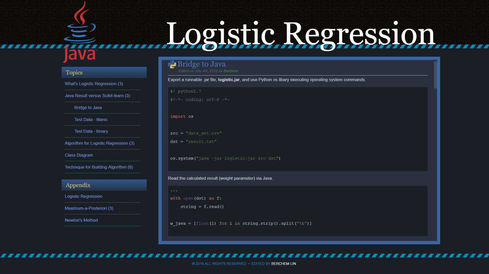

# Static Web for Logistic Regression
## File List
**Front Page** : [FrontPage.html](#front)

**Introduction** : [introduction.html](#intro)

**Result** : [result.html](#result)

**Algorithm** : [jupyter-notebook.html](#alg)

**Class Diagram** : [class_diagram_current.html](#cla)

**Program Design** : [technique.html](#pg)

**Maximum-a-Posteriori** : [map.html](#map)

**Newton's Method** : [newton.html](#newton)

## Preview

### <a name=front>Front Page]</a>

### <a name=intro>ntroduction</a>

### <a name=result>Result</a>

### <a name=alg>Algorithm</a>

### <a name=cla>Class Diagram</a>

### <a name=pg>Program Design</a>

### <a name=map>Maximum-a-Posteriori</a>

### <a name=newton>Newton's Method</a>
